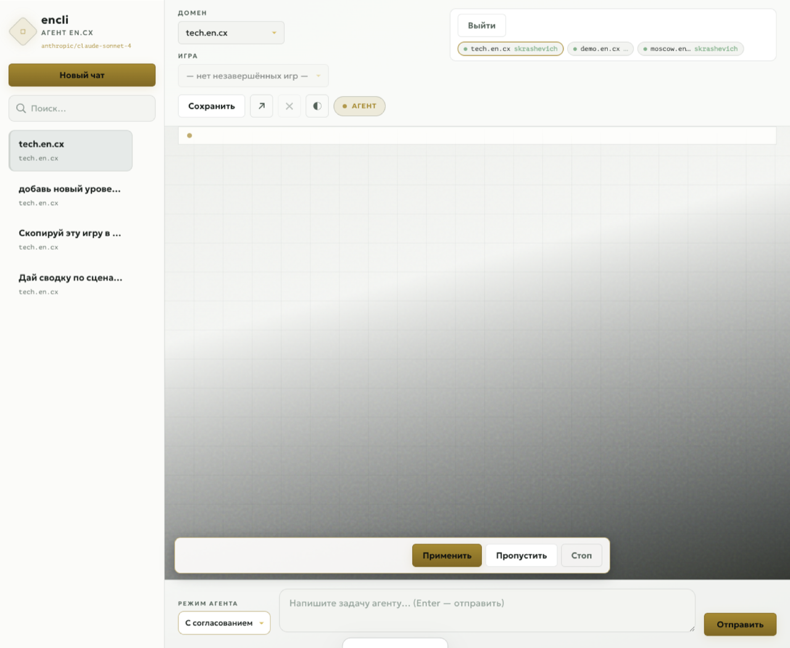
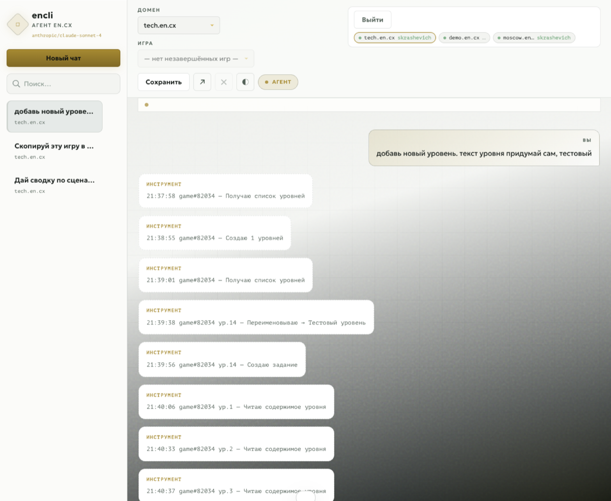
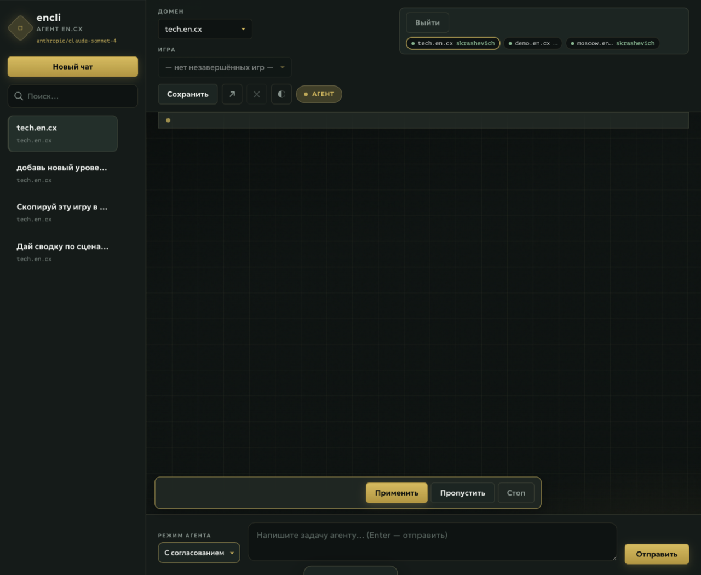

# encx-cli

<!-- badges:start -->
[](https://github.com/skrashevich/encx-cli/stargazers)
[](https://github.com/skrashevich/encx-cli/commits/main)
[](https://github.com/skrashevich/encx-cli/blob/main/LICENSE)
[![DeepWiki](https://img.shields.io/badge/DeepWiki-skrashevich%2Fencx--cli-blue.svg?logo=data:image/png;base64,iVBORw0KGgoAAAANSUhEUgAAACwAAAAyCAYAAAAnWDnqAAAAAXNSR0IArs4c6QAAA05JREFUaEPtmUtyEzEQhtWTQyQLHNak2AB7ZnyXZMEjXMGeK/AIi+QuHrMnbChYY7MIh8g01fJoopFb0uhhEqqcbWTp06/uv1saEDv4O3n3dV60RfP947Mm9/SQc0ICFQgzfc4CYZoTPAswgSJCCUJUnAAoRHOAUOcATwbmVLWdGoH//PB8mnKqScAhsD0kYP3j/Yt5LPQe2KvcXmGvRHcDnpxfL2zOYJ1mFwrryWTz0advv1Ut4CJgf5uhDuDj5eUcAUoahrdY/56ebRWeraTjMt/00Sh3UDtjgHtQNHwcRGOC98BJEAEymycmYcWwOprTgcB6VZ5JK5TAJ+fXGLBm3FDAmn6oPPjR4rKCAoJCal2eAiQp2x0vxTPB3ALO2CRkwmDy5WohzBDwSEFKRwPbknEggCPB/imwrycgxX2NzoMCHhPkDwqYMr9tRcP5qNrMZHkVnOjRMWwLCcr8ohBVb1OMjxLwGCvjTikrsBOiA6fNyCrm8V1rP93iVPpwaE+gO0SsWmPiXB+jikdf6SizrT5qKasx5j8ABbHpFTx+vFXp9EnYQmLx02h1QTTrl6eDqxLnGjporxl3NL3agEvXdT0WmEost648sQOYAeJS9Q7bfUVoMGnjo4AZdUMQku50McDcMWcBPvr0SzbTAFDfvJqwLzgxwATnCgnp4wDl6Aa+Ax283gghmj+vj7feE2KBBRMW3FzOpLOADl0Isb5587h/U4gGvkt5v60Z1VLG8BhYjbzRwyQZemwAd6cCR5/XFWLYZRIMpX39AR0tjaGGiGzLVyhse5C9RKC6ai42ppWPKiBagOvaYk8lO7DajerabOZP46Lby5wKjw1HCRx7p9sVMOWGzb/vA1hwiWc6jm3MvQDTogQkiqIhJV0nBQBTU+3okKCFDy9WwferkHjtxib7t3xIUQtHxnIwtx4mpg26/HfwVNVDb4oI9RHmx5WGelRVlrtiw43zboCLaxv46AZeB3IlTkwouebTr1y2NjSpHz68WNFjHvupy3q8TFn3Hos2IAk4Ju5dCo8B3wP7VPr/FGaKiG+T+v+TQqIrOqMTL1VdWV1DdmcbO8KXBz6esmYWYKPwDL5b5FA1a0hwapHiom0r/cKaoqr+27/XcrS5UwSMbQAAAABJRU5ErkJggg==)](https://deepwiki.com/skrashevich/encx-cli)
<!-- badges:end -->


`encx-cli` — это Go-клиент и CLI для API движка городских квестов Encounter (`en.cx`).

Если короче: здесь есть и библиотека для встраивания в свой код, и консольная утилита, которой можно быстро залогиниться, посмотреть игру, прочитать задания и отправить код без браузера.

- Модуль: `github.com/skrashevich/encx-cli`
- CLI: `cmd/encli`
- Пакет-библиотека: `encx`
- Тестовый домен для примеров и интеграционных тестов: `tech.en.cx`

## Что внутри

Проект пригодится в двух сценариях:

- хотите написать свой тулинг поверх Encounter API — берите пакет `encx`;
- хотите просто работать из терминала — ставьте `encli`.

## Установка

### Готовые бинарники

Подписанные и нотаризованные бинарники для macOS, Linux и Windows доступны на странице [Releases](https://github.com/skrashevich/encx-cli/releases). macOS-бинарники подписаны сертификатом Developer ID и прошли нотаризацию Apple — Gatekeeper не покажет предупреждение о недоверенном разработчике.

### CLI

```sh
go install github.com/skrashevich/encx-cli/cmd/encli@latest
```

### Docker

```sh
docker run --rm ghcr.io/skrashevich/encx-cli -v
docker run --rm ghcr.io/skrashevich/encx-cli games -domain tech.en.cx

# LLM-режим: передайте ключ и модель через -e
docker run --rm \
  -e ENCX_LOGIN=user -e ENCX_PASSWORD=secret -e ENCX_GAME_ID=12345 \
  -e LLM_API_KEY=sk-or-v1-... \
  -e LLM_MODEL=anthropic/claude-sonnet-4 \
  ghcr.io/skrashevich/encx-cli -game-id 12345 --llm "покажи уровни"
```


### Библиотека

```sh
go get github.com/skrashevich/encx-cli/encx
```

## Использование библиотеки

Ниже минимальный пример: логинимся, смотрим список игр, читаем состояние и пробуем отправить код.

```go
package main

import (
	"context"
	"fmt"
	"log"

	"github.com/skrashevich/encx-cli/encx"
)

func main() {
	client := encx.New("tech.en.cx", encx.WithInsecureTLS())
	ctx := context.Background()

	resp, err := client.Login(ctx, "user", "password")
	if err != nil {
		log.Fatal(err)
	}
	if resp.Error != 0 {
		log.Fatalf("Login error %d: %s", resp.Error, encx.LoginErrorText(resp.Error))
	}

	// Список игр
	list, _ := client.GetGameList(ctx)
	for _, g := range list.ActiveGames {
		fmt.Printf("%d: %s\n", g.GameID, g.Title)
	}

	// Состояние игры
	model, _ := client.GetGameModel(ctx, 12345)
	if model.Level != nil {
		fmt.Printf("Уровень %d: %s\n", model.Level.Number, model.Level.Name)
	}

	// Отправка кода
	result, _ := client.SendCode(ctx, 12345, model.Level.LevelId, model.Level.Number, "КОД123")
	if result.EngineAction != nil && result.EngineAction.LevelAction != nil &&
		result.EngineAction.LevelAction.IsCorrectAnswer != nil &&
		*result.EngineAction.LevelAction.IsCorrectAnswer {
		fmt.Println("Верный код!")
	}

	// Список игр с пагинацией
	page2, _ := client.GetGameList(ctx, 2)
	for _, g := range page2.ComingGames {
		fmt.Printf("%d: %s (levels: %d)\n", g.GameID, g.Title, g.LevelNumber)
	}

	// Статистика игры
	stats, _ := client.GetGameStatistics(ctx, 12345)
	if stats.Game != nil {
		fmt.Printf("Игра: %s, Уровней: %d\n", stats.Game.Title, len(stats.Levels))
		for _, l := range stats.Levels {
			fmt.Printf("  Уровень %d: %s\n", l.LevelNumber, l.LevelName)
		}
	}
}
```

### Опции клиента

Можно подкрутить поведение клиента через опции:

| Опция | Описание |
|---|---|
| `WithInsecureTLS()` | Пропустить проверку TLS-сертификата |
| `WithHTTP()` | Использовать HTTP вместо HTTPS |
| `WithTimeout(d)` | Установить таймаут HTTP-клиента |
| `WithUserAgent(ua)` | Установить User-Agent |
| `WithLang(lang)` | Язык запросов (по умолчанию: `ru`) |

## iOS (gomobile)

Пакет `mobile/encxmobile` — gomobile-обёртка над `encx` для встраивания в нативное iOS-приложение. API возвращает JSON-строки, которые декодируются в Swift через `JSONDecoder`.

### Сборка Encx.xcframework

```sh
# из корня репозитория
./mobile/bind-ios.sh

# результат: mobile/build/Encx.xcframework
```

Скрипт устанавливает `gomobile`, прогоняет тесты и собирает фреймворк для устройства и симулятора.

### Подключение в Xcode

1. Перетащите `Encx.xcframework` в проект (Embed & Sign).
2. Добавьте в **Info.plist** разрешение на сеть (если ещё нет):

```xml
<key>NSAppTransportSecurity</key>
<dict>
  <key>NSAllowsArbitraryLoads</key>
  <true/>
</dict>
```

> Для production лучше настроить ATS exceptions только для нужных доменов (`*.en.cx`).

### Пример (Swift)

```swift
import Encx

guard let client = EncxmobileNewClient("tech.en.cx", true) else { return }

// Авторизация
var loginErr: NSError?
let loginJSON = client.login("user", password: "secret", error: &loginErr)
if let err = loginErr { print(err); return }

struct LoginResponse: Decodable {
    let Error: Int
    let Message: String
}
let login = try JSONDecoder().decode(LoginResponse.self, from: loginJSON.data(using: .utf8)!)
guard login.Error == 0 else {
    print(EncxmobileLoginErrorText(login.Error))
    return
}

// Сохранение сессии (Keychain / UserDefaults)
if let cookies = client.exportCookies(&loginErr) {
    UserDefaults.standard.set(cookies, forKey: "encx_cookies")
}

// Состояние игры
let gameJSON = client.getGameModel(12345, error: &loginErr)
// decode GameModel from gameJSON...

// Отправка кода
let resultJSON = client.sendCode(12345, levelID: 67890, levelNumber: 1, code: "КОД123", error: &loginErr)
```

### Доступные методы

| Go (encxmobile) | Описание |
|---|---|
| `NewClient` / `NewClientWithOptions` | Создание клиента |
| `Login` / `LoginWithCaptcha` | Авторизация |
| `GetGameModel` | Состояние игры |
| `SendCode` / `SendBonusCode` | Отправка кодов |
| `GetPenaltyHint` | Штрафная подсказка |
| `GetGameList` / `GetDomainGames` | Список игр |
| `GetGameStatistics` | Статистика |
| `EnterGame` | Вступление в игру |
| `GetProfile` | Профиль пользователя |
| `ExportCookies` / `ImportCookies` | Сохранение сессии |
| `LoginErrorText` / `EventText` | Тексты ошибок |

## CLI: `encli`

`encli` полезен, когда нужно быстро дернуть API руками и не городить под это отдельный код.

Типичный поток такой:

1. залогиниться;
2. выбрать игру;
3. смотреть статус, задания и сообщения;
4. отправлять коды, бонусы и запрашивать подсказки.

```sh
# Авторизация (интерактивный ввод пароля)
encli login -domain tech.en.cx -insecure

# Список игр
encli games
encli game-list

# Статус игры
encli status -game-id 12345

# Задание текущего уровня
encli level -game-id 12345

# Все уровни с прогрессом
encli levels -game-id 12345

# Бонусы текущего уровня
encli bonuses -game-id 12345

# Подсказки (обычные и штрафные)
encli hints -game-id 12345

# Секторы текущего уровня
encli sectors -game-id 12345

# Лог пробитий кодов
encli log -game-id 12345

# Сообщения от организаторов
encli messages -game-id 12345

# Вступить в игру
encli enter -game-id 12345

# Отправка кодов
encli send-code -game-id 12345 "КОД123"
encli send-bonus -game-id 12345 "БОНУС"

# Запрос штрафной подсказки
encli hint -game-id 12345 42

# Статистика игры
encli game-stats -game-id 12345

# Профиль
encli profile

# Версия
encli -v

# LLM-агент (кратко; подробнее — раздел «LLM-агент и OpenRouter» ниже)
export LLM_API_KEY=sk-or-v1-...          # ключ с https://openrouter.ai/keys
export LLM_MODEL=anthropic/claude-sonnet-4  # любая модель из каталога OpenRouter

encli -game-id 12345 --llm "создай 3 уровня с бонусами и подсказками"
encli -game-id 12345 --llm "пройдись по уровням, проверь ответы и предложи исправления"
encli -readonly -game-id 12345 --llm "покажи содержимое всех уровней"  # без записи в игру

# Web UI с тем же ключом и моделью
encli -web

# Выход
encli logout

# --- Admin-команды ---

# Список авторских игр
encli admin-games

# Список уровней с ID
encli admin-levels -game-id 12345

# Создать 3 уровня
encli admin-create-levels -game-id 12345 3

# Удалить уровень №5
encli admin-delete-level -game-id 12345 5

# Переименовать уровень (ID из admin-levels)
encli admin-rename-level -game-id 12345 67890 "Новое название"

# Установить автопереход 1ч 30мин с штрафом 15мин
encli admin-set-autopass -game-id 12345 1 1:30:00 0:15:00

# Блокировка: 3 попытки за 1 минуту, на игрока
encli admin-set-block -game-id 12345 1 3 0:01:00 player

# Создать бонус (уровень 1, level-id 67890, название, ответы)
encli admin-create-bonus -game-id 12345 1 67890 "Бонус 1" "ответ1" "ответ2"

# Удалить бонус
# bonus-id берите из admin-level-content
# там бонусы печатаются как [bonus <id>]
encli admin-delete-bonus -game-id 12345 1 <bonus-id>

# Создать сектор
encli admin-create-sector -game-id 12345 1 "Сектор А" "код1" "код2"

# Посмотреть содержимое уровня и найти sector-id
encli admin-level-content -game-id 12345 1

# Удалить сектор
# sector-id берите из admin-level-content
# там секторы печатаются как [sector <id>]
encli admin-delete-sector -game-id 12345 1 <sector-id>

# Обновить сектор
# sector-id берите из admin-level-content
# пример: переименовать сектор и заменить список ответов
encli admin-update-sector -game-id 12345 1 <sector-id> name="Сектор Б" answers="код3,код4"

# Создать подсказку (откроется через 30 минут)
encli admin-create-hint -game-id 12345 1 0:30:00 "Текст подсказки"

# Удалить подсказку
# hint-id берите из admin-level-content
# там подсказки печатаются как [hint <id>]
encli admin-delete-hint -game-id 12345 1 <hint-id>

# Создать задание
encli admin-create-task -game-id 12345 1 "Текст задания уровня"

# Обновить задание
# task-id берите из admin-level-content
# там задания печатаются как [task <id>]
encli admin-update-task -game-id 12345 1 <task-id> "Новый текст задания"

# Установить имя и комментарий уровня
encli admin-set-comment -game-id 12345 1 "Название" "Комментарий для орга"

# Список команд в игре
encli admin-teams -game-id 12345

# Начисления бонусного/штрафного времени
encli admin-corrections -game-id 12345
encli admin-add-correction -game-id 12345 "Team Name" bonus 0:10:00 0 "за красоту"
encli admin-delete-correction -game-id 12345 444

# Чтение содержимого уровня (задание, секторы, бонусы, подсказки, настройки)
encli admin-level-content -game-id 12345 1

# Сообщения уровня
# сначала посмотрите список сообщений и их message-id
encli admin-messages -game-id 12345 1

# создать сообщение
# здесь 67890 — это level-id, его берите из admin-levels
encli admin-create-message -game-id 12345 67890 "Текст сообщения"

# обновить сообщение
# message-id берите из admin-messages
encli admin-update-message -game-id 12345 1 <message-id> text="Новый текст" mode=chosen levels=67890

# удалить сообщение
# message-id берите из admin-messages
encli admin-delete-message -game-id 12345 1 <message-id>

# Информация об игре (название, авторы, описание, дата финиша)
encli admin-game-info -game-id 12345

# Обновить настройки игры (название, описание, приз)
encli admin-update-game -game-id 12345 title="Новое название" description="Описание"

# Полная очистка игры (обнуление)
encli admin-wipe-game -game-id 67890

# Копирование игры целиком (из 12345 в 67890)
# Рекомендуется сначала admin-wipe-game на целевой
encli admin-copy-game -game-id 12345 67890

# Перестановка и клонирование уровней
encli admin-swap-levels -game-id 12345 2 5
encli admin-insert-level -game-id 12345 3 0
encli admin-clone-levels -game-id 12345 2 1

# Обновление бонуса и подсказки
encli admin-update-bonus -game-id 12345 1 <bonus-id> name="Новое имя" answers="код1,код2"
encli admin-update-hint -game-id 12345 1 <hint-id> text="Новый текст" delay=0:45:00

# Удаление задания
encli admin-delete-task -game-id 12345 1 <task-id>

# Жизненный цикл игры
encli admin-deliver -game-id 12345
encli admin-not-deliver -game-id 12345
encli admin-award-points -game-id 12345
encli admin-end-ratings -game-id 12345
encli admin-calc-ik -game-id 12345
encli admin-action-monitor -game-id 12345
```

## LLM-агент и OpenRouter

`encli` встраивает агента с tool-calling: он читает состояние игры, вызывает admin-команды, ищет факты в Википедии и читает локальные файлы со сценарием. Агент доступен в CLI (`--llm`), в локальном Web UI (`-web`) и в Docker (через `-e`).

### API-ключ и модель

По умолчанию используется [OpenRouter](https://openrouter.ai/) (`https://openrouter.ai/api/v1`) и бесплатная модель `openai/gpt-oss-120b:free`. Чтобы использовать **свой ключ** и **другую модель**, задайте переменные окружения (или передайте их в `docker run -e ...`):

| Переменная | Алиас | Назначение |
|---|---|---|
| `LLM_API_KEY` | `OPENROUTER_API_KEY` | API-ключ OpenRouter ([получить](https://openrouter.ai/keys)) |
| `LLM_MODEL` | `OPENROUTER_MODEL` | Идентификатор модели в каталоге OpenRouter, например `anthropic/claude-sonnet-4` или `google/gemini-2.5-pro-preview` |
| `LLM_BASE_URL` | `OPENROUTER_BASE_URL` | Base URL OpenAI-совместимого API (если не OpenRouter) |

Приоритет: сначала `LLM_*`, затем `OPENROUTER_*`. Для localhost (`127.0.0.1` / `localhost` в URL) ключ не обязателен — удобно для локального прокси.

**Примеры:**

```sh
# Разовый запуск с другой моделью
LLM_API_KEY=sk-or-v1-XXXX LLM_MODEL=anthropic/claude-sonnet-4 \
  encli -game-id 12345 --llm "создай уровень с бонусом"

# Постоянная настройка в shell
export LLM_API_KEY=sk-or-v1-XXXX
export LLM_MODEL=google/gemini-2.5-flash-preview
encli -game-id 12345 --llm "проверь ответы на уровне 3"

# Старые имена переменных (обратная совместимость)
export OPENROUTER_API_KEY=sk-or-v1-XXXX
export OPENROUTER_MODEL=openai/gpt-4o
encli -game-id 12345 --llm "покажи статус"

# Локальный OpenAI-совместимый сервер (Ollama, LiteLLM, Cursor proxy и т.п.)
export LLM_BASE_URL=http://127.0.0.1:8317/v1
export LLM_MODEL=my-local-model
encli -game-id 12345 --llm "покажи уровни"
```

Список моделей и цены: [openrouter.ai/models](https://openrouter.ai/models). В конце сессии агент печатает **отчёт**: модель, число запросов к LLM, токены и ориентировочная стоимость (для OpenRouter — по прайсу из `/models`).

### Режим `--llm`

```sh
encli -game-id 12345 --llm "скопируй игру 82033 в 82034"
encli -debug -game-id 12345 --llm "покажи статус игры"   # подробный лог в stderr
encli -readonly -game-id 12345 --llm "аудит всех уровней" # без изменений в игре
```

Для review-запросов (`проверь ответы`, `найди ошибки`) агент **не применяет** правки сразу: сначала предлагает исправления, затем CLI (или Web UI) спрашивает подтверждение по каждому пункту.

Поведение агента:

- Вызовы инструментов выводятся в читаемом виде (например, `[admin_level_content] Читаю содержимое уровня 3`).
- Большие ответы tool-call'ов сжимаются перед отправкой обратно в модель.
- При 429 и 502–504 — до 3 повторов с нарастающей задержкой.
- После создания или изменения уровней агент проверяет результат (коды, тайминги, подсказки, задания).

### Web UI (`-web`)

Локальный чат с тем же агентом, историей диалогов и переключателем режима безопасности (только чтение / с подтверждением / полный доступ):

```sh
export LLM_API_KEY=sk-or-v1-...
export LLM_MODEL=anthropic/claude-sonnet-4
encli -web
# по умолчанию http://127.0.0.1:8787 — откроется в браузере

encli -web -web-addr 0.0.0.0:8787   # слушать на всех интерфейсах
# или: ENCLI_WEB_ADDR=0.0.0.0:8787 encli -web
```

В шапке UI отображается текущая модель (из `LLM_MODEL` / `OPENROUTER_MODEL`). Сессии Encounter логинятся через UI; чаты сохраняются в `~/.config/encli/web/chats/`.

#### Скриншоты

Общий вид: боковая панель с историей чатов, выбор домена и игры, авторизация, поле ввода и режим агента (только чтение / с согласованием / полный доступ). В левом верхнем углу — текущая LLM-модель.



Чат с агентом: запрос на естественном языке и пошаговые вызовы инструментов (admin API, чтение уровней и т.д.).



Тёмная тема (переключатель ◐ в верхней панели).



### Локальные файлы и Википедия

Агент может читать сценарии с диска и сверять факты:

| Инструмент | Назначение |
|---|---|
| `read_local_file` | Прочитать текстовый файл |
| `list_local_dir` | Список файлов в каталоге |
| `search_local_files` | Поиск по содержимому / glob |
| `wikipedia_search` | Поиск статей |
| `wikipedia_article` | Краткое содержание статьи |

Корень для локальных путей — `LLM_FILES_ROOT` (по умолчанию текущая рабочая директория); файлы вне этого каталога недоступны.

```sh
export LLM_FILES_ROOT=~/quests/my-scenario
encli -game-id 12345 --llm "прочитай levels.md и создай уровни по сценарию"
```

## Команды CLI

| Команда | Что делает |
|---|---|
| `login` | Логинится и сохраняет сессию |
| `logout` | Чистит сохраненную сессию |
| `games` | Показывает список игр через HTML-страницу домена |
| `game-list` | Показывает список игр через JSON API |
| `status` | Показывает текущее состояние игры |
| `level` | Печатает текст текущего задания |
| `levels` | Показывает все уровни с прогрессом |
| `bonuses` | Показывает бонусы текущего уровня |
| `hints` | Показывает подсказки (обычные и штрафные) |
| `sectors` | Показывает секторы текущего уровня |
| `log` | Показывает лог пробитий кодов |
| `messages` | Показывает сообщения от организаторов |
| `enter` | Подает заявку на вход в игру |
| `send-code` | Отправляет код уровня |
| `send-bonus` | Отправляет бонусный код |
| `hint` | Запрашивает штрафную подсказку |
| `game-stats` | Показывает статистику игры (уровни, команды, результаты) |
| `profile` | Показывает профиль текущего пользователя (ранг, очки, домен) |
| `--llm <prompt>` | Естественно-языковая команда через LLM-агента (OpenRouter или совместимый API) |
| `-web` | Локальный Web UI для агента (чат, история, режимы безопасности) |
| `-readonly` | Запретить агенту инструменты, изменяющие игру (для `--llm` и `-web`) |
| `-v` | Показывает версию |

**Admin-команды (требуют прав редактора игры):**

| Команда | Что делает |
|---|---|
| `admin-games` | Показывает список авторских игр |
| `admin-levels` | Показывает все уровни с их ID (админка) |
| `admin-create-levels` | Создаёт указанное количество новых уровней |
| `admin-delete-level` | Удаляет уровень по номеру |
| `admin-rename-level` | Переименовывает уровень |
| `admin-set-autopass` | Устанавливает таймер автоперехода |
| `admin-set-block` | Настраивает блокировку ответов |
| `admin-create-bonus` | Создаёт бонус на уровне |
| `admin-delete-bonus` | Удаляет бонус по ID |
| `admin-create-sector` | Создаёт сектор на уровне |
| `admin-delete-sector` | Удаляет сектор по ID |
| `admin-update-sector` | Обновляет сектор по ID |
| `admin-create-hint` | Создаёт подсказку на уровне |
| `admin-delete-hint` | Удаляет подсказку по ID |
| `admin-update-hint` | Обновляет подсказку по ID |
| `admin-create-task` | Создаёт задание на уровне |
| `admin-update-task` | Обновляет задание по ID |
| `admin-set-comment` | Устанавливает название и комментарий уровня |
| `admin-teams` | Показывает команды в игре |
| `admin-corrections` | Показывает начисления бонусного/штрафного времени |
| `admin-add-correction` | Добавляет начисление времени |
| `admin-delete-correction` | Удаляет начисление по ID |
| `admin-level-content` | Читает содержимое уровня (задание, секторы, бонусы, подсказки, настройки) |
| `admin-create-message` | Создаёт игровое сообщение |
| `admin-messages` | Показывает сообщения уровня |
| `admin-update-message` | Обновляет сообщение по ID |
| `admin-delete-message` | Удаляет сообщение по ID |
| `admin-game-info` | Показывает информацию об игре (название, авторы, описание, дата) |
| `admin-update-game` | Обновляет настройки игры (название, описание, приз и др.) |
| `admin-deliver` | Помечает игру как состоявшуюся |
| `admin-award-points` | Начисляет очки участникам |
| `admin-end-ratings` | Завершает приём оценок |
| `admin-calc-ik` | Считает игровой коэффициент |
| `admin-wipe-game` | Полностью обнуляет игру (удаляет всё содержимое) |
| `admin-copy-game` | Копирует всю игру (уровни, настройки, бонусы, секторы, подсказки) в другую |
| `admin-swap-levels` | Меняет местами два уровня по номеру |
| `admin-insert-level` | Перемещает уровень на новую позицию |
| `admin-clone-levels` | Клонирует N уровней с настроек существующего |
| `admin-delete-task` | Удаляет задание по ID |
| `admin-update-bonus` | Обновляет бонус по ID (`key=value`) |
| `admin-update-hint` | Обновляет подсказку по ID (`key=value`) |
| `admin-action-monitor` | Показывает монитор действий в игре |
| `admin-not-deliver` | Помечает игру как несостоявшуюся |

### Флаги и переменные окружения

Почти все можно передавать либо через флаги, либо через env. Удобно, если гоняете команды часто.

| Флаг | Env-переменная | Описание |
|---|---|---|
| `-domain` | `ENCX_DOMAIN` | Домен Encounter (по умолчанию: `tech.en.cx`) |
| `-login` | `ENCX_LOGIN` | Логин |
| `-password` | `ENCX_PASSWORD` | Пароль |
| `-game-id` | `ENCX_GAME_ID` | ID игры |
| `-insecure` | `ENCX_INSECURE` | Пропустить проверку TLS-сертификата |
| `-http` | — | Использовать HTTP вместо HTTPS |
| `-json` | — | Выводить результат в формате JSON |
| `-debug` | `ENCX_DEBUG` | Включить отладочный вывод в `stderr` |
| `-web-addr` | `ENCLI_WEB_ADDR` | Адрес Web UI (по умолчанию: `127.0.0.1:8787`) |
| `-readonly` | — | Блокировать у агента инструменты записи (см. также режим в Web UI) |
| — | `LLM_BASE_URL` | Base URL OpenAI-совместимого API (по умолчанию: `https://openrouter.ai/api/v1`) |
| — | `OPENROUTER_BASE_URL` | Алиас для `LLM_BASE_URL` |
| — | `LLM_API_KEY` | API-ключ для `--llm` и `-web` (не нужен для localhost) |
| — | `LLM_MODEL` | Модель для агента (по умолчанию: `openai/gpt-oss-120b:free`) |
| — | `LLM_FILES_ROOT` | Корень каталога для `read_local_file` / `search_local_files` (по умолчанию: cwd) |
| — | `OPENROUTER_API_KEY` | Алиас для `LLM_API_KEY` |
| — | `OPENROUTER_MODEL` | Алиас для `LLM_MODEL` |

Пример:

```sh
export ENCX_DOMAIN=tech.en.cx
export ENCX_LOGIN=my_login
export ENCX_PASSWORD=my_password
export ENCX_GAME_ID=12345
export ENCX_DEBUG=1

# LLM (OpenRouter)
export LLM_API_KEY=sk-or-v1-...
export LLM_MODEL=anthropic/claude-sonnet-4

encli login -insecure
encli status
encli -debug status
encli -game-id 12345 --llm "покажи уровни"
```

В `-debug` режиме `encli` пишет в `stderr` полный разбор аргументов, шаги LLM-агента, запуск и завершение tool-call'ов, а также HTTP-запросы `encx` с таймингами. Вывод не обрезается — данные показываются целиком для полноценной диагностики.

Подробнее про агента, смену модели и Web UI — в разделе [LLM-агент и OpenRouter](#llm-агент-и-openrouter).

### Сборка из исходников

```sh
go build -o encli ./cmd/encli/
```

## API

Ниже краткая шпаргалка по основным методам, которые уже завернуты в клиент.

| Метод | Endpoint | Описание |
|---|---|---|
| `Login` | `POST /login/signin` | Авторизация |
| `GetGameModel` | `POST /gameengines/encounter/play/{id}` | Состояние игры |
| `SendCode` | `POST /gameengines/encounter/play/{id}` | Отправка кода уровня |
| `SendBonusCode` | `POST /gameengines/encounter/play/{id}` | Отправка бонусного кода |
| `GetPenaltyHint` | `GET /gameengines/encounter/play/{id}` | Запрос штрафной подсказки |
| `GetGameList` | `GET /home/?json=1` | Список игр (JSON, с пагинацией) |
| `GetDomainGames` | `GET m.{domain}/` | Список игр (HTML) |
| `GetGameStatistics` | `GET /gamestatistics/full/{id}?json=1` | Полная статистика игры |
| `GetTimeoutToGame` | `GET m.{domain}/gameengines/encounter/play/{id}` | Таймер до начала |
| `EnterGame` | `POST /gameengines/encounter/makefee/Login.aspx` | Вступить в игру |
| `GetGameDetails` | `GET /GameDetails.aspx?gid={id}` | Детали игры (HTML) |
| `GetTeamDetails` | `GET /Teams/TeamDetails.aspx?tid={id}` | Информация о команде |
| `AcceptTeamInvitation` | `GET /Teams/TeamDetails.aspx?action=accept_invitation&tid={id}` | Принять приглашение |

**Admin API (требует прав редактора):**

| Метод | Endpoint | Описание |
|---|---|---|
| `AdminGetLevels` | `GET /Administration/Games/LevelManager.aspx` | Список уровней (ID, названия) |
| `AdminCreateLevels` | `GET /Administration/Games/LevelManager.aspx?levels=create` | Создание уровней |
| `AdminDeleteLevel` | `GET /Administration/Games/LevelManager.aspx?levels=delete` | Удаление уровня |
| `AdminRenameLevels` | `POST /Administration/Games/LevelManager.aspx?level_names=update` | Переименование уровней |
| `AdminUpdateAutopass` | `POST /Administration/Games/LevelEditor.aspx` | Настройка автоперехода |
| `AdminUpdateAnswerBlock` | `POST /Administration/Games/LevelEditor.aspx` | Настройка блокировки ответов |
| `AdminCreateBonus` | `POST /Administration/Games/BonusEdit.aspx?action=save` | Создание бонуса |
| `AdminDeleteBonus` | `GET /Administration/Games/BonusEdit.aspx?action=delete` | Удаление бонуса |
| `AdminCreateSector` | `POST /Administration/Games/LevelEditor.aspx` | Создание сектора |
| `AdminDeleteSector` | `GET /Administration/Games/LevelEditor.aspx?delsector={id}` | Удаление сектора |
| `AdminCreateHint` | `POST /Administration/Games/PromptEdit.aspx` | Создание подсказки |
| `AdminDeleteHint` | `GET /Administration/Games/PromptEdit.aspx?action=PromptDelete` | Удаление подсказки |
| `AdminCreateTask` | `POST /Administration/Games/TaskEdit.aspx` | Создание задания |
| `AdminUpdateComment` | `POST /Administration/Games/NameCommentEdit.aspx` | Обновление названия/комментария |
| `AdminGetTeams` | `GET /Administration/Games/TaskEdit.aspx` | Список команд |
| `AdminGetCorrections` | `GET /GameBonusPenaltyTime.aspx` | Список начислений времени |
| `AdminAddCorrection` | `POST /GameBonusPenaltyTime.aspx?action=save` | Добавление начисления |
| `AdminDeleteCorrection` | `GET /GameBonusPenaltyTime.aspx?action=delete` | Удаление начисления |
| `AdminGetLevelSettings` | `GET /Administration/Games/LevelEditor.aspx` | Чтение настроек уровня (автопереход, блокировка) |
| `AdminGetBonusIds` | `GET /Administration/Games/LevelEditor.aspx` | Список ID бонусов на уровне |
| `AdminGetBonus` | `GET /Administration/Games/BonusEdit.aspx?action=edit` | Чтение деталей бонуса |
| `AdminGetHintIds` | `GET /Administration/Games/LevelEditor.aspx` | Список ID подсказок на уровне |
| `AdminGetHint` | `GET /Administration/Games/PromptEdit.aspx?action=PromptEdit` | Чтение деталей подсказки (обычной и штрафной) |
| `AdminGetTaskIds` | `GET /Administration/Games/LevelEditor.aspx` | Список ID заданий на уровне |
| `AdminGetTask` | `GET /Administration/Games/TaskEdit.aspx?action=TaskEdit` | Чтение деталей задания |
| `AdminGetComment` | `GET /Administration/Games/NameCommentEdit.aspx` | Чтение названия и комментария уровня |
| `AdminGetSectorAnswers` | `GET /ALoader/LevelInfo.aspx` | Чтение секторов и ответов уровня |
| `AdminGetGameInfo` | `GET /Administration/Games/GameEditor.aspx` | Чтение настроек игры (название, авторы, описание, приз, дата) |
| `AdminUpdateGameInfo` | `POST /Administration/Games/GameEditor.aspx` | Обновление настроек игры |
| `AdminWipeGame` | (комбинированный) | Полная очистка игры (удаление всего содержимого) |
| `AdminCopyGame` | (комбинированный) | Полное копирование игры (уровни, настройки, бонусы, секторы, подсказки) |

Полная неофициальная (полученная методом реверс-инжиниринга) спецификация API в формате OpenAPI 3.1: [openapi.yaml](openapi.yaml).

Поддерживаемые домены: `*.en.cx`, `*.encounter.cx`, `*.encounter.ru`. Домен `quest.ua` deprecated — мигрирован в `{city}questua.en.cx` (напр. `kharkov.quest.ua` -> `kharkovquestua.en.cx`).

## Тестовый домен

Для тестирования собственных разработок предусмотрен специализированный домен `tech.en.cx`. Чтобы получить на нём права создания игр (исключительно в технологических целях) — напишите в [техподдержку сети](https://world.en.cx/UserDetails.aspx?uid=7).

## Тесты

Интеграционные тесты ходят в `tech.en.cx`:

```sh
ENCX_INTEGRATION=1 go test ./encx/ -v -count=1
```

Если переменную `ENCX_INTEGRATION` не задавать, запустятся только юнит-тесты.
